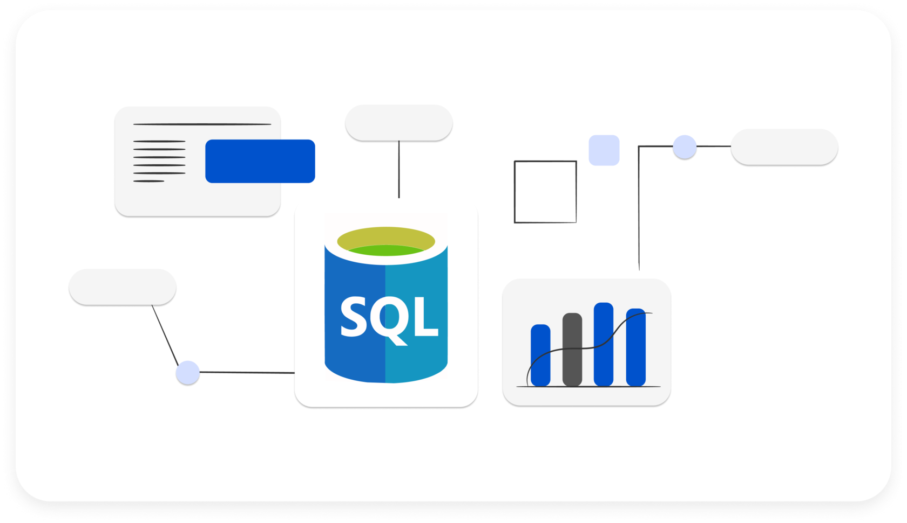

우리가 실습에 활용하는 데이터는 대부분 **여러 테이블이 미리 결합된 형태로 제공됩니다.**

덕분에 별도의 데이터 연결 과정 없이 바로 분석과 시각화에 집중할 수 있습니다.

**하지만,** 회사의 데이터는 대부분 **데이터베이스(DB)**에 저장되어 있고,

그 데이터베이스에서 데이터를 꺼내는 공식 표준 언어가 **SQL**입니다.

또한, 데이터 분석가가 되기 위해선,

어떤 질문에 대해 데이터 구조로 해석하는 **'데이터 리터러시'**가 필요합니다.

> ❓ 데이터 리터러시란?
>
> **데이터를 읽고 이해한 것을 바탕으로 분석 결과를 전달하는 능력**

우리가 일상에서 던지는 질문들:

- "이번 달 **매출**은 얼마야?"
- "어제보다 오늘 방문자가 **늘었어**?"
- "**재구매한 고객**만 따로 보고 싶어"
- "**최근 3개월 동안** 가장 많이 팔린 상품은?"

이 질문들은 겉으로 보면 그냥 말이지만,

데이터 리터러시 관점에서는 이렇게 다시 해석됩니다.

- 어떤 **테이블**에서?
- 어떤 **조건(WHERE)** 으로?
- 어떤 **기준(GROUP BY)** 으로 묶어서?
- 무엇을 **집계(SUM, COUNT)** 할 것인가?
- 어떤 **기간(BETWEEN, DATE)** 인가?

우리는 이번 SQL 세션을 통해,
이러한 비즈니스 질문들을 **데이터 리터러시 관점**으로 해석하는 방법에 대해 연습할 예정입니다.
