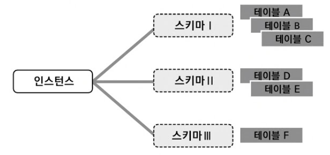

# 1-2. 데이터 베이스 기본 구조



### ① 인스턴스(Instance)

**정의**

- 인스턴스(Instance)는 "현재 실행 중인 데이터베이스 프로그램 자체"
- **메모리를 점유하고 동작 중인 MySQL 프로그램**

**예시**

```text
MySQL 서버 (localhost:3306) ← 인스턴스
 ├─ basic_sql     ← 우리가 실습하는 DB
 ├─ sparta
 ├─ startdbmy
 └─ sys           ← 시스템 전용
```

### ② 데이터베이스(Database, DB)

**정의**

- **데이터들을 가장 큰 단위로 묶어 관리하는 "논리적 저장 공간"**
- 하나의 MySQL 서버 안에는 **여러 개의 데이터베이스가 동시에 존재**할 수 있습니다.

**특징**

- 데이터베이스끼리는 **완전히 분리됨**
- 서로 다른 DB끼리는 **JOIN도 불가능**
- 보통 용도별로 나눔
- 운영용 DB / 개발 DB / 테스트 DB 등등

### ③ 스키마(Schema)

**정의:** 테이블을 논리적으로 묶는 "중간 폴더 개념"

> ❓ **MySQL에서는?**
>
> - ✅ **MySQL에서는 스키마 = 데이터베이스**
> - 즉, MySQL에서는 `Database = Schema = 같은 개념`
>
> 그래서 MySQL에서는 이 두 표현을 **혼용해서 사용**합니다.

### ④ 테이블(Table)

**정의:** 실제 데이터가 행(Row) 단위로 저장되는 구조

**실무적 의미**

- 엑셀 시트 한 장 = 테이블 1개
- 테이블에는 각종 컬럼(속성)과 행(데이터)이 들어 있습니다.

### ⑤ 컬럼(Column) - 열, 속성, 필드

**정의:** 테이블의 "항목(속성)"

예시 (`emp` 테이블):

| **컬럼명** | **의미** |
| --- | --- |
| empno | 사번 |
| ename_ko | 이름 |
| joblv | 직급 |
| deptno | 부서번호 |
| employed | 재직여부 |

### ⑥ 행(Row) - 튜플, 레코드

**정의:** 한 사람, 한 건의 실제 데이터 1줄

예시 (`emp`):

| **empno** | **ename_ko** | **joblv** | **deptno** | **employed** |
| --- | --- | --- | --- | --- |
| 7002 | 김낙수 | 부장 | 11 | TRUE |
