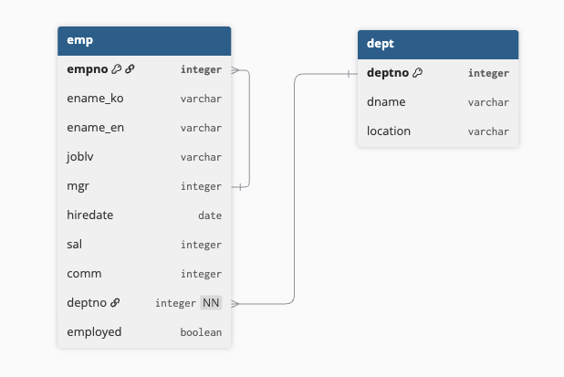
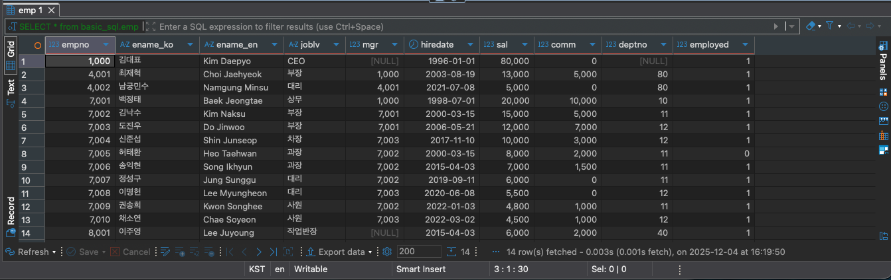
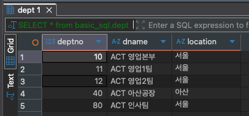
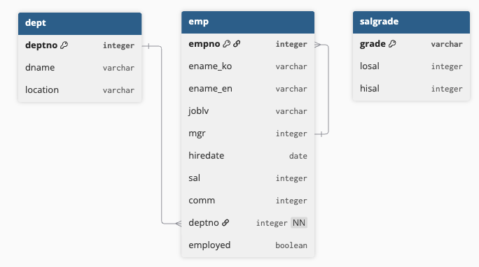
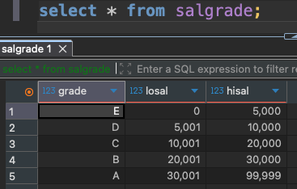

# 2-2. 실습 데이터 소개

## 1. 데이터 알아보기


- 실습 테이블 ERD



### 1. `emp` 테이블 (14행 * 10열)

| **순번** | **컬럼명** | **논리명** | **데이터 타입** | **설명** |
| --- | --- | --- | --- | --- |
| 1 | empno | 사번 | integer | 사원을 식별하는 고유 번호. 전 사원에 대해 유일하게 부여되는 키 값. |
| 2 | ename_ko | 사원명(한글) | varchar | 사원의 한글 이름 (예: 김대표, 백정태, 김낙수 등). |
| 3 | ename_en | 사원명(영문) | varchar | 사원의 영문 이름 (예: Kim Daepyo, Baek Jeogtae). |
| 4 | joblv | 직급 | varchar | 사원의 직급 / 직책 정보 (예: CEO, 상무, 부장, 차장, 대리, 사원 등). |
| 5 | mgr | 상사 사번 | integer | 사원의 직속 상사의 empno. 최상위 관리자(CEO 등)는 NULL 가능. 자기참조 관계를 형성. |
| 6 | hiredate | 입사일 | date | 사원의 최초 입사 일자. 인사/근속 연수 계산 등에 활용. |
| 7 | sal | 기본급 | integer | 사원의 월 기본급 또는 연봉 기준 급여 금액. 단위는 시스템 정의(예: 만원/원). |
| 8 | comm | 성과급/커미션 | integer | 사원의 성과급, 커미션 등 변동 보상 금액. 해당 없을 시 0 또는 NULL. |
| 9 | deptno | 부서번호 | integer | 사원이 소속된 부서의 번호. `dept.deptno`를 참조하는 외래키(FK). |
| 10 | employed | 재직 여부 | boolean | 사원의 재직 상태. TRUE = 재직, FALSE = 퇴사/휴직 등. 인사 이력 관리에 활용. |

### 2. `dept` 테이블 (5행 * 3열)

| **순번** | **컬럼명** | **논리명** | **데이터 타입** | **설명** |
| --- | --- | --- | --- | --- |
| 1 | deptno | 부서번호 | integer | 부서를 식별하는 고유 번호. 모든 부서에 대해 유일하게 부여되는 키 값. |
| 2 | dname | 부서명 | varchar | 부서의 명칭 (예: ACT 영업본부, ACT 영업1팀 등). |
| 3 | location | 위치 | varchar | 부서의 근무 지역 또는 사업장 위치 (예: 서울, 아산). |

## 2. 데이터를 넣어봅시다

첨부된 **DDL 스크립트**를 실행해주면 됩니다.

[DDL.sql](../examples/DDL.sql)

### 1. 데이터베이스 만들기

```sql
-- 기존에 basic_sql 데이터베이스가 존재하면 삭제 (동일한 이름으로 다시 생성하기 위해 초기화하는 과정)
DROP DATABASE IF EXISTS basic_sql;

-- basic_sql 이라는 이름의 새로운 데이터베이스 생성
CREATE DATABASE basic_sql
  DEFAULT CHARACTER SET utf8mb4
  COLLATE utf8mb4_general_ci;

-- 앞으로 실행되는 모든 쿼리를 basic_sql 데이터베이스 기준으로 수행
USE basic_sql;
```

### 2. `emp` 테이블 만들기

```sql
-- emp 테이블이 이미 존재하면 먼저 삭제
DROP TABLE IF EXISTS emp;

-- 사원 정보를 저장하는 emp 테이블 생성
CREATE TABLE basic_sql.emp (
  empno     INT PRIMARY KEY,
  ename_ko  VARCHAR(50),
  ename_en  VARCHAR(100),
  joblv     VARCHAR(50),
  mgr       INT,
  hiredate  DATE,
  sal       INT,
  comm      INT,
  deptno    INT,
  employed  BOOLEAN
);
```

### 3. `dept` 테이블 만들기

```sql
-- dept 테이블이 이미 존재하면 먼저 삭제 (재실행 시 오류 방지 및 초기화 목적)
DROP TABLE IF EXISTS dept;

-- 부서 정보를 저장하는 dept 테이블 생성
CREATE TABLE basic_sql.dept (
  deptno   INT PRIMARY KEY,
  dname    VARCHAR(100),
  location VARCHAR(100)
);
```

### 4. `emp` 테이블 데이터 적재

```sql
-- emp 테이블에 기존 데이터가 있으면 모두 삭제 (초기화)
DELETE FROM emp;

-- 사원 데이터 신규 등록
INSERT INTO basic_sql.emp
(empno, ename_ko, ename_en, joblv, mgr, hiredate, sal, comm, deptno, employed)
VALUES
(1000, '김대표', 'Kim Daepyo', 'CEO', NULL, '1996-01-01', 80000, 0, NULL, TRUE),
(7001, '백정태', 'Baek Jeongtae', '상무', 1000, '1998-07-01', 20000, 10000, 10, TRUE),
(7002, '김낙수', 'Kim Naksu', '부장', 7001, '2000-03-15', 15000, 5000, 11, TRUE),
(4001, '최재혁', 'Choi Jaehyeok', '부장', 1000, '2003-08-19', 13000, 5000, 80, TRUE),
(7003, '도진우', 'Do Jinwoo', '부장', 7001, '2006-05-21', 12000, 7000, 12, TRUE),
(7004, '신준섭', 'Shin Junseop', '차장', 7003, '2017-11-10', 10000, 3000, 12, TRUE),
(7005, '허태환', 'Heo Taehwan', '과장', 7002, '2000-03-15', 8000, 2000, 11, FALSE),
(7006, '송익현', 'Song Ikhyun', '과장', 7002, '2015-04-03', 7000, 1500, 11, TRUE),
(7007, '정성구', 'Jung Sunggu', '대리', 7002, '2019-09-11', 6000, 0, 11, TRUE),
(7008, '이명헌', 'Lee Myungheon', '대리', 7003, '2020-06-08', 5500, 0, 12, TRUE),
(4002, '남궁민수', 'Namgung Minsu', '대리', 4001, '2021-07-08', 5000, 0, 80, TRUE),
(7009, '권송희', 'Kwon Songhee', '사원', 7002, '2022-01-03', 4800, 1000, 11, TRUE),
(7010, '채소연', 'Chae Soyeon', '사원', 7003, '2022-03-02', 4500, 1000, 12, TRUE),
(8001, '이주영', 'Lee Juyoung', '작업반장', NULL, '2015-04-03', 6000, 2000, 40, TRUE);
```

### 5. `dept` 테이블 데이터 적재

```sql
-- dept 테이블에 기존 데이터가 있으면 모두 삭제 (초기화)
DELETE FROM dept;

-- 부서 데이터 신규 등록
INSERT INTO dept (deptno, dname, location) VALUES
  (10, 'ACT 영업본부', '서울'),
  (11, 'ACT 영업1팀', '서울'),
  (12, 'ACT 영업2팀', '서울'),
  (40, 'ACT 아산공장', '아산'),
  (80, 'ACT 인사팀', '서울');
```

### 6. 조회해서 적재 확인하기

새 SQL 스크립트를 열고 아래 코드를 쳐서 데이터가 잘 나오면 적재 완료입니다.

```sql
SELECT * FROM basic_sql.emp;
```



```sql
SELECT * FROM basic_sql.dept;
```



## 1-1. 추가 데이터 소개

- 실습 테이블 ERD



- `salgrade`는 급여 구간 매핑용 테이블
- FK로 직접 연결되기보다는, 조회 시 `총급여(sal + comm)` 기준으로 조건 조인하여 활용

### 1. `salgrade` 테이블 (5행 * 3열)

| **순번** | **컬럼명** | **논리명** | **데이터 타입** | **설명** |
| --- | --- | --- | --- | --- |
| 1 | grade | 급여 등급 | varchar | 급여 구간을 나타내는 등급 코드. A~E 등급으로 구성되며, 급여 수준을 단순화하여 분류하는 기준 값. 기본키(PK)로 사용됨. |
| 2 | losal | 최소 급여 | integer | 해당 급여 등급에 포함되는 **최소 총급여 기준값**. `sal + comm` 기준으로 등급 매핑 시 하한값 역할. |
| 3 | hisal | 최대 급여 | integer | 해당 급여 등급에 포함되는 **최대 총급여 기준값**. `sal + comm` 기준으로 등급 매핑 시 상한값 역할. |

## 1-2. 데이터 추가하기

첨부된 **DDL 스크립트**를 실행해주면 됩니다.

[DDL2.sql](../examples/DDL2.sql)

### 1. `salgrade` 테이블 만들기

```sql
-- salgrade 테이블이 이미 존재하면 먼저 삭제 (재실행 시 오류 방지 및 초기화 목적)
DROP TABLE IF EXISTS salgrade;

-- 등급 정보를 저장하는 salgrade 테이블 생성
CREATE TABLE basic_sql.salgrade
       (grade VARCHAR(5),
        losal INT,
        hisal INT);
```

### 2. `salgrade` 테이블 데이터 적재

```sql
-- salgrade 테이블에 기존 데이터가 있으면 모두 삭제 (초기화)
DELETE FROM salgrade;

-- 등급 데이터 신규 등록
INSERT INTO salgrade (grade, losal, hisal) VALUES
  ('E', 0, 5000),
  ('D', 5001, 10000),
  ('C', 10001, 20000),
  ('B', 20001, 30000),
  ('A', 30001, 99999);
```

### 3. 조회해서 적재 확인하기

새 SQL 스크립트를 열고 아래 코드를 쳐서 데이터가 잘 나오면 적재 완료입니다.

```sql
SELECT * FROM basic_sql.salgrade;
```


