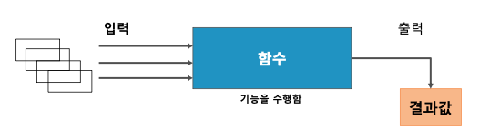

# 4-1. 함수란?

- **개념**: 입력값을 받아 특정 연산을 수행하고 결과값을 반환하는 데이터 처리 도구

- **분류**
  - 단일행 함수 (Single-Row Function)
    - 문자열 함수
    - 숫자형 함수
    - 날짜형 함수
    - 변환형 함수
    - Null 관련 함수
  - 다중행 함수 (Multi-Row Function)
    - 집계 함수 (Aggregate Function)
    - 그룹 함수 (Group Function)
    - 윈도우 함수 (Window Function)
